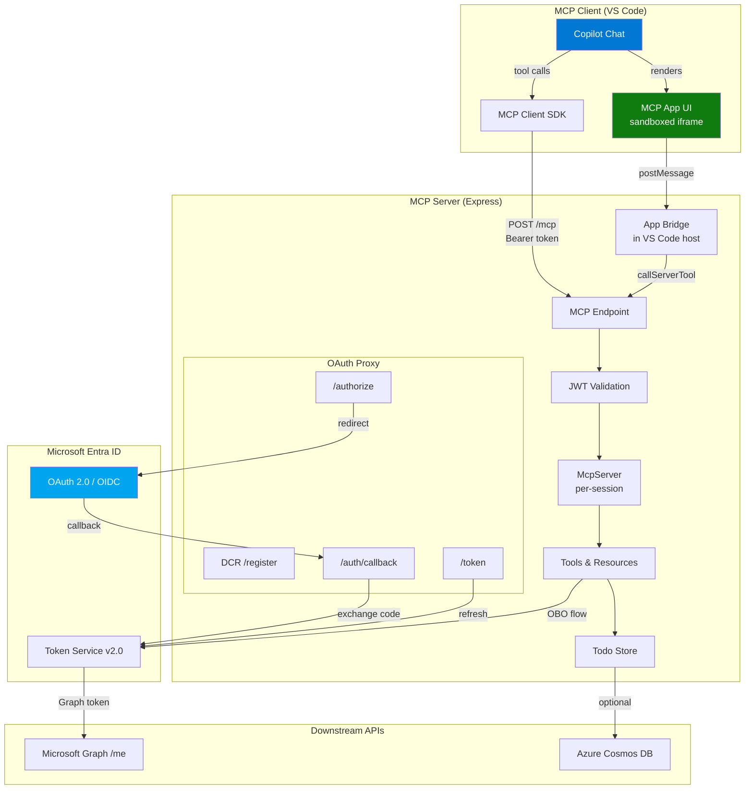
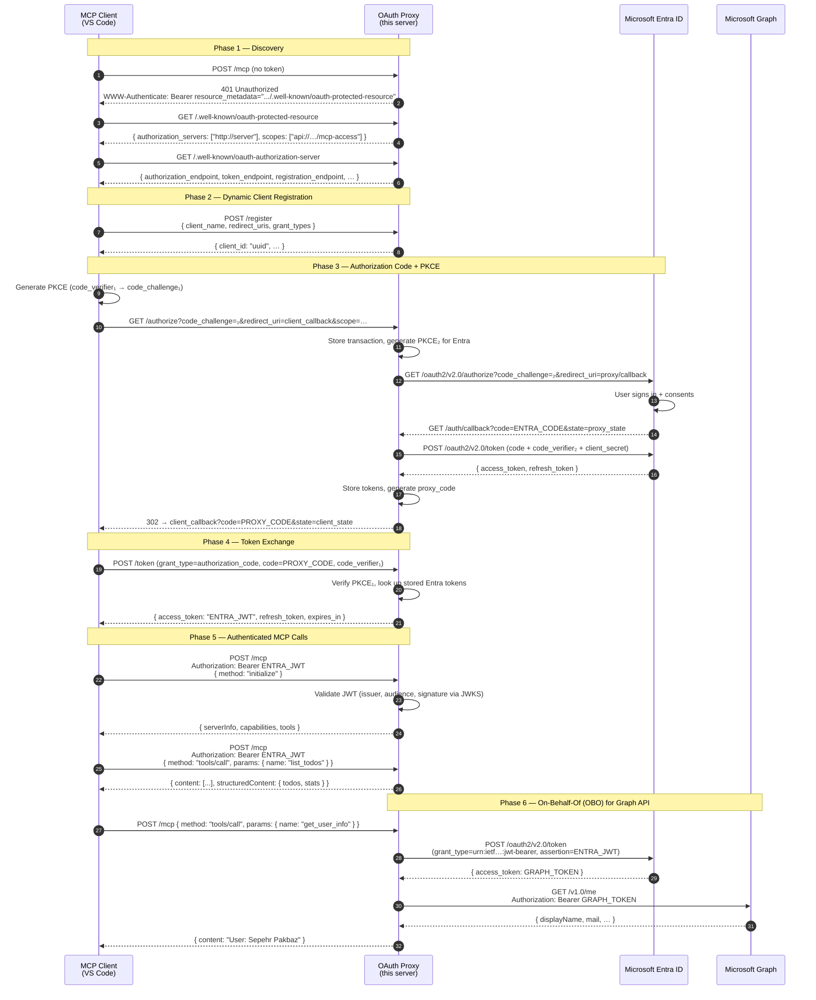
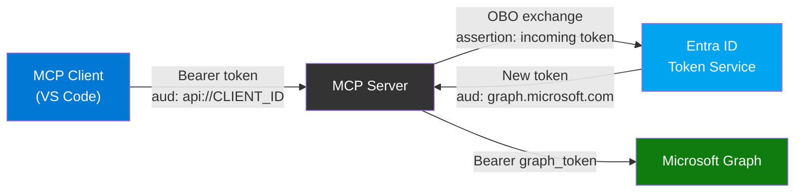
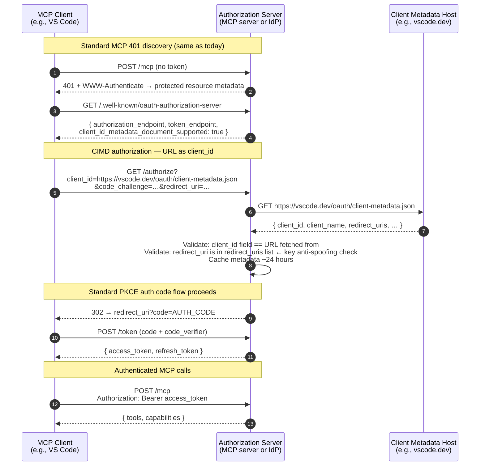
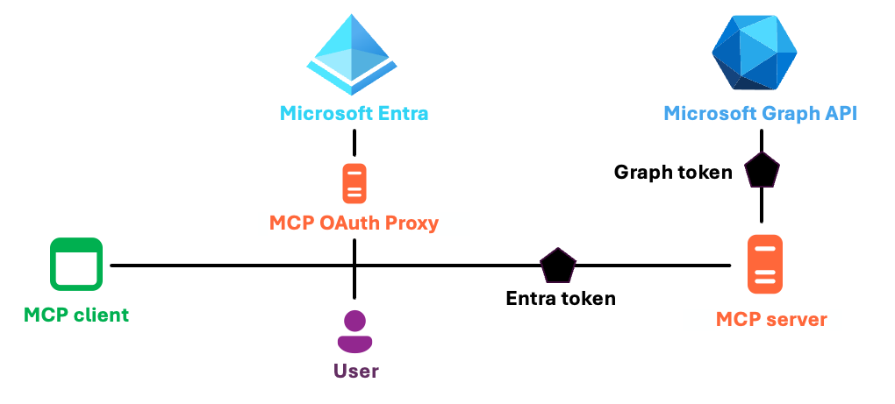
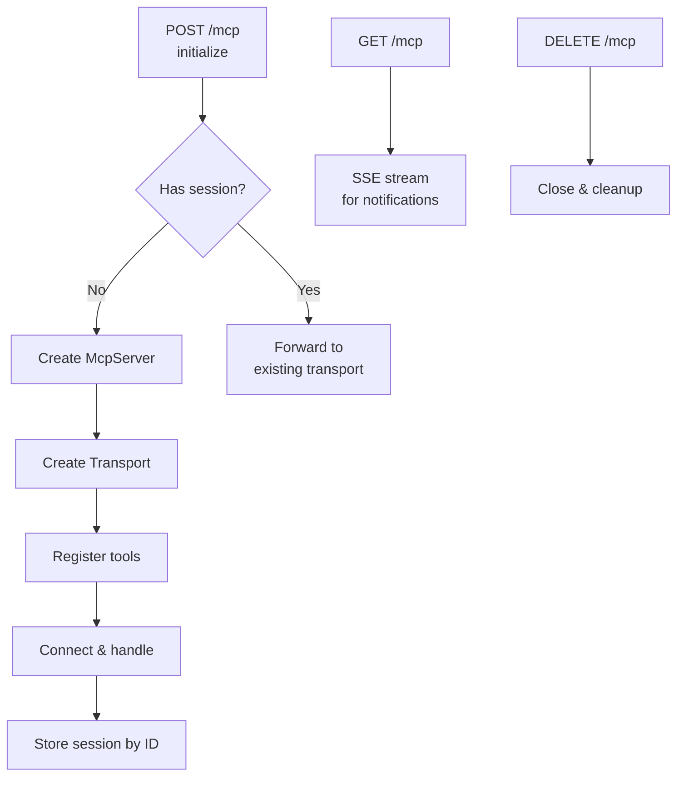
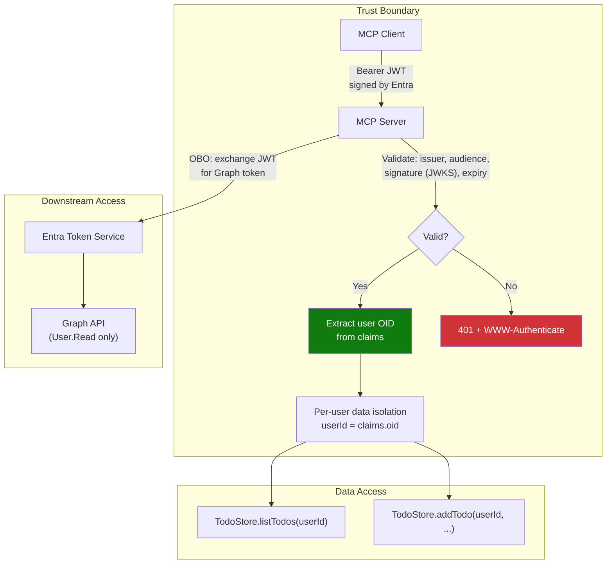

# MCP Todo App — Authenticated with Microsoft Entra ID

A full-featured **Model Context Protocol (MCP)** server with interactive UI,
**Microsoft Entra ID** authentication, and **On-Behalf-Of (OBO)** flow for
downstream API access. Built with TypeScript, Express, and the MCP SDK.

> **Key Concepts**: OAuth Proxy pattern for Entra ID, Dynamic Client Registration
> (DCR) bridging, PKCE, JWT validation, MCP Apps (ext-apps) interactive UI.
>
> **Also covered**: [CIMD (Client ID Metadata Documents)](#cimd--client-id-metadata-documents-newer-mcp-auth) —
> the MCP November 2025 spec's preferred default auth mechanism, with a full
> pros/cons comparison vs. the OAuth Proxy and a migration guide.

---

## Architecture Overview



---

## Authentication Flow

This app uses the **OAuth Proxy pattern** to integrate MCP's required
Dynamic Client Registration (DCR) with Microsoft Entra ID — which does not
natively support DCR. The MCP server itself acts as an OAuth authorization
server that proxies to Entra.

> ⚠️ **Production warning (per Microsoft):** The OAuth Proxy / DCR approach is
> **intended only for development and testing scenarios**. For production, Microsoft
> recommends using **pre-registered client applications** where client identifiers
> and permissions are explicitly created, reviewed, and approved on a per-app
> basis. The hope is that Entra will eventually support CIMD natively, enabling
> a fully production-ready MCP auth story without the proxy.
> ([source](https://techcommunity.microsoft.com/blog/azuredevcommunityblog/using-on-behalf-of-flow-for-entra-based-mcp-servers/4486760))

## Options for Authenticated MCP Servers

MCP auth is built on **OAuth 2.1**. Every MCP client is an OAuth client; every MCP server is a resource server.

| Approach | How it works | Entra supports? |
|---|---|---|
| **Pre-registered clients only** | Explicit app reg per MCP client | ✅ Yes — but inflexible |
| **Dynamic Client Registration (DCR)** | Auth server registers new clients on the fly (RFC 7591) | ❌ Not natively |
| **Client ID Metadata Documents (CIMD)** | Auth server fetches a metadata doc from the client | ❌ Not natively |

For **arbitrary MCP clients** (VS Code, Claude, bots ...), DCR or CIMD is required.
For **known clients only**, pre-registration works and is the production recommendation.

### Why an OAuth Proxy?

MCP clients (like VS Code) expect to register dynamically and perform OAuth
flows per [RFC 7591 (DCR)](https://datatracker.ietf.org/doc/html/rfc7591).
Entra ID supports **authorization server metadata** (RFC 8414) and **protected
resource metadata**, but does **not** support DCR or CIMD. If your MCP server
is only used with pre-authorized clients (e.g., exclusively VS Code in a known
tenant), no proxy is needed. The proxy is only required when you need to support
**arbitrary MCP clients**. It bridges this gap:

| MCP Client expects | Entra ID provides | Proxy bridges |
|---|---|---|
| Dynamic Client Registration | Pre-registered apps only | `POST /register` → generates proxy `client_id` |
| Standard OAuth endpoints | Entra's v2.0 endpoints | Maps all endpoints through the proxy |
| PKCE with client | PKCE with server | Dual PKCE — one for client↔proxy, one for proxy↔Entra |

### Sequence Diagram — Full OAuth Flow



### Token Flow Summary



---

## CIMD — Client ID Metadata Documents (Newer MCP Auth)

**CIMD** (Client ID Metadata Documents) was introduced as the **preferred default**
client registration mechanism in the [MCP November 2025 spec update](https://spec.modelcontextprotocol.io/specification/2025-11-25/authorization/)
(tracked as [SEP-991](https://github.com/modelcontextprotocol/modelcontextprotocol/issues/991)).
It is also being standardized as an [IETF draft](https://datatracker.ietf.org/doc/draft-ietf-oauth-client-id-metadata-document/)
(promoted to working group status in October 2025).

The MCP spec positions the two mechanisms as:
- **CIMD** — `SHOULD` (the default that all new servers should implement)
- **DCR** — `MAY` (optional fallback, supported for backward compatibility)

CIMD flips the DCR model entirely: instead of clients **POSTing** registration data
to the server's `/register` endpoint, **the `client_id` itself is a URL** that
points to a publicly hosted JSON document describing the client. The authorization
server fetches and caches that document when it sees a URL-shaped `client_id`,
making domain ownership the trust anchor.

```
DCR (old):  client → POST /register → server stores client entry
CIMD (new): client → passes URL as client_id → server fetches JSON from that URL
```

CIMD supports both **public** and **confidential** clients:

**Public client** (e.g., a desktop app — cannot keep a secret; uses PKCE):
```json
{
  "client_id": "https://vscode.dev/oauth/client-metadata.json",
  "client_name": "Visual Studio Code",
  "client_uri": "https://vscode.dev",
  "redirect_uris": ["https://vscode.dev/oauth/callback"],
  "token_endpoint_auth_method": "none",
  "grant_types": ["authorization_code", "refresh_token"],
  "response_types": ["code"]
}
```

**Confidential client** (e.g., a server-side app — authenticates with a private key, no shared secret):
```json
{
  "client_id": "https://app.example.com/oauth/client-metadata.json",
  "client_name": "Example MCP Server",
  "client_uri": "https://app.example.com",
  "redirect_uris": ["https://app.example.com/callback"],
  "token_endpoint_auth_method": "private_key_jwt",
  "jwks_uri": "https://app.example.com/oauth/jwks.json",
  "grant_types": ["authorization_code"],
  "response_types": ["code"]
}
```

With confidential clients, the server signs a JWT using its private key at the
token endpoint; the authorization server verifies the signature using the public
key from `jwks_uri`. **No shared `client_secret` is exchanged or stored** —
this is a meaningful improvement over DCR for server-to-server scenarios.

The `client_id` field **must exactly match** the URL hosting the document — this
self-referential binding is what makes domain ownership the proof of identity.
VS Code, for example, publishes its own metadata at `https://vscode.dev/oauth/client-metadata.json`.

### How CIMD Works



### How CIMD Prevents Client Impersonation

A natural question: what stops an attacker at `evil.com` from using
`https://vscode.dev/oauth/client-metadata.json` as their `client_id` and
stealing tokens?

The answer is **`redirect_uri` validation against the fetched metadata**:

1. Attacker sends `/authorize?client_id=https://vscode.dev/oauth/client-metadata.json&redirect_uri=https://evil.com/callback`
2. Server fetches `https://vscode.dev/oauth/client-metadata.json`
3. Server checks the `redirect_uris` array in that file — `https://evil.com/callback` is not listed
4. Request is **rejected before any code is issued**

The attacker cannot receive the authorization code because they don't control
`vscode.dev`. To impersonate VS Code they would need to compromise Microsoft's
infrastructure — vastly harder than spoofing a DCR `client_name` string.

### Why This App Still Uses the OAuth Proxy

This app targets **Microsoft Entra ID**, which is one of the identity providers
that **does not yet support CIMD** (as of early 2026). Entra only supports
pre-registered applications — no DCR, no CIMD metadata fetching. The full
compatibility picture:

| Identity Provider | DCR | CIMD |
|---|---|---|
| **Stytch** | ✅ | ✅ (first major provider, demo at [client.dev](https://client.dev)) |
| **WorkOS AuthKit** | ✅ | ✅ (built for MCP) |
| **Authlete** | ✅ | ✅ (November 2025) |
| **Auth0** | ✅ | ⚠️ in progress (see [Auth0 MCP docs](https://auth0.com/docs/authenticate/protocols/mcp)) |
| **Okta** | ✅ | ❌ not yet |
| **AWS Cognito** | ❌ | ❌ |
| **Azure AD / Entra ID** | ❌ | ❌ (pre-registration only) |

Because Entra supports neither DCR nor CIMD, this app implements a full
**OAuth Proxy** that acts as its own authorization server and bridges to Entra
behind the scenes. If you switch to a CIMD-capable provider (Stytch, WorkOS),
you can eliminate the proxy entirely.

### CIMD vs. OAuth Proxy — Comparison

| Aspect | OAuth Proxy (this app) | CIMD |
|---|---|---|
| **Registration model** | DCR — client POSTs to `/register`, server issues a proxy `client_id` | Client hosts JSON at a URL; server fetches it on first use |
| **Trust anchor** | Proxy code + in-memory transaction state | DNS / domain ownership — only you can host metadata at your domain |
| **Registration endpoint** | Required and exposed as a public POST endpoint | Not needed — no `/register` route at all |
| **Client ID sprawl** | High — every client instance creates a new entry | None — all instances of the same app share one URL |
| **DoS surface** | Registration endpoint can be spammed | No registration endpoint to abuse |
| **Identity verification** | None — any client can claim any `client_name` | Strong — impersonating `cursor.sh` requires compromising cursor.sh |
| **Server state** | Proxy stores pending auth transactions + Entra refresh tokens | Stateless — no token or session storage on the server |
| **Entra ID compatible** | ✅ (this app's core purpose) | ❌ Entra does not fetch CIMD metadata |
| **OBO flow** | ✅ Fully supported | ✅ Unchanged — server still needs a client secret |
| **MCP spec status** | Required fallback for non-DCR providers today | **Preferred default** since November 2025 spec |

### Pros of CIMD

- **No registration endpoint** — Eliminates the primary DoS and spam attack vector of DCR
- **Built-in identity** — Domain ownership is a strong proof of client identity; attackers cannot spoof `cursor.sh` without compromising that infrastructure
- **No client ID sprawl** — Thousands of VS Code instances all share `https://vscode.dev/oauth/client-metadata.json`; no cleanup jobs needed
- **Stateless authorization server** — Server fetches + caches metadata but stores no auth state; resilient to restarts
- **Simpler server code** — No proxy logic, no dual-PKCE, no in-memory transaction maps
- **Smaller attack surface** — The server never stores Entra refresh tokens or transient proxy codes
- **Standard and extensible** — IETF-backed draft; forward path to software statements and platform attestation (signed JWTs that cryptographically prove binary identity)
- **Better UX** — Consent screens can show the real app name and logo from the metadata

### Cons of CIMD

- **SSRF risk** — The authorization server must make outbound HTTPS requests to fetch metadata; a malicious `client_id` could target internal services (e.g., `https://169.254.169.254/`). Mitigate by blocking RFC 1918 / loopback ranges, enforcing HTTPS, capping response size at ~5–10 KB, and disabling redirects.
- **Unverified domain problem** — CIMD proves the client *owns* a domain, not that the client is *trustworthy*. `my-shady-app.com` is a valid CIMD client. Production servers should implement trust tiers (show consent warnings for unknown domains, maintain allowlists for known good clients).
- **Localhost ambiguity** — A client running on `https://localhost:1234` cannot prove which process is listening on that port; CIMD cannot distinguish the legitimate app from a local attacker. This is a known open problem.
- **Entra ID does not support it** — If your identity provider is Azure AD / Entra ID, you cannot use CIMD today; the OAuth Proxy approach remains the only option.
- **Caching lag** — Metadata is cached ~24 hours; rotating `redirect_uris` requires waiting for cache expiry or manual invalidation across all authorization servers.
- **No dynamic multi-tenant routing** — With the proxy, the server can route users to the correct Entra tenant at runtime; CIMD cements the IdP at discovery time.
- **OBO still needs server credentials** — CIMD simplifies client registration but does not remove the need for server-side credentials (client secret or private key) if downstream API access (Graph, Cosmos) is required.

### Migrating This App to CIMD

If you swap Entra ID for a CIMD-capable provider (e.g., Stytch or WorkOS), the
migration is straightforward:

1. **Remove** `src/auth/oauth-proxy.ts` — the entire DCR + authorize + callback + token proxy
2. **Update** `/.well-known/oauth-protected-resource` to point at the new IdP's
   issuer URL instead of the server itself:

   ```json
   {
     "resource": "https://your-server.com",
     "authorization_servers": ["https://your-new-idp.com"],
     "scopes_supported": ["mcp:read", "mcp:write"]
   }
   ```

3. **Advertise CIMD support** in `/.well-known/oauth-authorization-server` by adding:

   ```json
   { "client_id_metadata_document_supported": true }
   ```

4. **Keep** `src/auth/validate-jwt.ts` — JWT validation is identical regardless of registration method
5. **Keep** `src/auth/obo-helper.ts` — OBO for downstream APIs is unchanged
6. **Add SSRF protection** when fetching client metadata URLs (block RFC 1918 / loopback ranges, cap at 5–10 KB, disallow redirects, set aggressive timeouts)

### The Road Ahead: Software Statements

CIMD is a major improvement but still has the **localhost** and **unverified domain** gaps. The community is already working on the next layer: **Software Statements** ([RFC 7591 §2.3](https://datatracker.ietf.org/doc/html/rfc7591#section-2.3)).

A Software Statement is a signed JWT embedded in the CIMD metadata:

```json
{
  "client_id": "https://app.example.com/oauth/client-metadata.json",
  "software_statement": "eyJhbGciOiJSUzI1NiJ9..."
}
```

The statement contains claims about the client signed by a **trusted authority** —
an app store, an OS vendor (Apple, Microsoft), or a vendor registry. Crucially,
a Software Statement alone doesn't fix anything; its security comes entirely from
the **trust model** the authorization server applies to the signer:

| Signer | What it proves |
|---|---|
| App Store (Apple / Google) | Binary is from the listed publisher; passed review |
| OS attestation (macOS, Windows) | Specific `bundle_id` / `team_id` is running on this device |
| Vendor registry | Organization has been vetted and enrolled |

When combined with **platform-level attestation**, the chain becomes: "I am
the official VS Code binary (bundle ID `com.microsoft.VSCode`, team ID `UBF8T346G9`),
running on this macOS device, signed by Apple" — verifiable without any
pre-registration and impossible to fake without compromising Apple's signing infrastructure.

This future model completely eliminates the localhost ambiguity: the OS can attest
which specific binary is listening on a port, making port-based impersonation
inherently impossible.

---

## Project Structure

```
├── src/
│   ├── server.ts              # Express app, MCP endpoint, session management
│   ├── tools.ts               # MCP tool & resource registration (ext-apps)
│   ├── auth/
│   │   ├── oauth-proxy.ts     # OAuth proxy (DCR, authorize, callback, token)
│   │   ├── validate-jwt.ts    # JWT validation middleware (Entra ID)
│   │   └── obo-helper.ts      # On-Behalf-Of flow (MSAL Node)
│   ├── store/
│   │   └── cosmos-store.ts    # Todo storage (Cosmos DB or in-memory)
│   └── ui/
│       ├── todo-app.ts        # Interactive HTML UI template
│       └── ext-apps-bundle.js # Inlined ext-apps SDK (bundled)
├── infra/                     # Azure Bicep IaC (Container Apps, Cosmos DB)
├── .vscode/mcp.json           # MCP server config for VS Code
├── azure.yaml                 # Azure Developer CLI config
├── Dockerfile                 # Container image
└── .env                       # Local environment variables (not committed)
```

---

## Key Components



### 1. OAuth Proxy (`src/auth/oauth-proxy.ts`)

Bridges MCP's DCR requirement with Entra ID's pre-registered app model.

| Endpoint | Purpose |
|---|---|
| `GET /.well-known/oauth-authorization-server` | RFC 8414 metadata — tells clients where to register, authorize, and get tokens |
| `POST /register` | Dynamic Client Registration — issues a proxy `client_id` to MCP clients |
| `GET /authorize` | Stores the client's PKCE, generates a new PKCE for Entra, redirects to Entra login |
| `GET /auth/callback` | Receives Entra's auth code, exchanges it for tokens, issues a proxy code to the client |
| `POST /token` | Validates the client's PKCE, returns the Entra tokens (or refreshes them) |
| `POST /revoke` | Token revocation (graceful no-op) |

### 2. JWT Validation (`src/auth/validate-jwt.ts`)

Express middleware that validates Entra ID v2.0 Bearer tokens on every MCP request:

- Fetches signing keys from Entra's JWKS endpoint (cached)
- Verifies issuer (`https://login.microsoftonline.com/{tenant}/v2.0`), audience (`client_id`), and signature (RS256)
- Extracts user claims (`oid`, `name`, `preferred_username`) into `req.auth`
- Returns `401` with `WWW-Authenticate: Bearer resource_metadata="..."` on missing/invalid tokens — this triggers VS Code's automatic OAuth flow

### 3. On-Behalf-Of Helper (`src/auth/obo-helper.ts`)

Uses MSAL Node's `ConfidentialClientApplication` to exchange the incoming MCP access token for downstream API tokens:

```
Incoming token (aud: api://CLIENT_ID/mcp-access)
        ↓ OBO flow (grant_type: urn:ietf:params:oauth:grant-type:jwt-bearer)
Downstream token (aud: https://graph.microsoft.com)
        ↓
GET /v1.0/me → { displayName, mail, ... }
```

The OBO exchange works because admin consent was pre-granted to the server's
service principal for the required Graph scopes. Without pre-granted consent,
the token exchange returns a `invalid_grant` error. This is a key setup step
that differs from user-facing OAuth flows where the user grants consent interactively.

**Alternative SDK — FastMCP (Python):** Microsoft's official blog post demonstrates
this same pattern using the [FastMCP](https://gofastmcp.com/) Python SDK with its
built-in [`AzureProvider`](https://gofastmcp.com/integrations/azure), which handles
the DCR-over-Entra proxy and OBO token acquisition. The full reference implementation
is available at [Azure-Samples/python-mcp-demos](https://github.com/Azure-Samples/python-mcp-demos).

### 4. MCP Apps UI (`src/ui/todo-app.ts`)

Interactive HTML UI rendered inside VS Code's Copilot Chat panel:

- Uses the `@modelcontextprotocol/ext-apps` SDK (inlined to avoid CSP issues)
- Communicates with the server via `app.callServerTool()` (postMessage bridge)
- Supports light/dark theme, inline editing, filtering, and real-time updates

### 5. Session Management (`src/server.ts`)

Each MCP client connection gets its own `McpServer` + `StreamableHTTPServerTransport` pair:



---

## Entra ID App Registration

### Required Configuration

| Setting | Value |
|---|---|
| **App type** | Web application |
| **Redirect URI** | `http://localhost:8000/auth/callback` (dev) |
| **API scope** | `api://{CLIENT_ID}/mcp-access` |
| **API permissions** | Microsoft Graph → `User.Read` (delegated) |
| **Client secret** | Required for OBO flow |

### Register via Azure CLI

> **Note:** The redirect URI list must include `https://vscode.dev/redirect` to
> support VS Code's built-in OAuth flow, alongside your server's callback URL.
> If deploying to a hosted URL, add that URL's `/auth/callback` as well.

```bash
# Create the app registration
az ad app create \
  --display-name "MCP Todo App" \
  --sign-in-audience AzureADMyOrg \
  --web-redirect-uris "http://localhost:8000/auth/callback" "https://vscode.dev/redirect" \
  --enable-access-token-issuance true \
  --enable-id-token-issuance true

# Add the API scope (mcp-access)
APP_ID=$(az ad app list --display-name "MCP Todo App" --query "[0].appId" -o tsv)
OBJECT_ID=$(az ad app list --display-name "MCP Todo App" --query "[0].id" -o tsv)

az rest --method PATCH \
  --uri "https://graph.microsoft.com/v1.0/applications/$OBJECT_ID" \
  --headers "Content-Type=application/json" \
  --body "{
    \"identifierUris\": [\"api://$APP_ID\"],
    \"api\": {
      \"requestedAccessTokenVersion\": 2,
      \"oauth2PermissionScopes\": [{
        \"id\": \"$(uuidgen)\",
        \"adminConsentDisplayName\": \"Access MCP Todo App\",
        \"adminConsentDescription\": \"Allows the app to access MCP Todo App on behalf of the user\",
        \"userConsentDisplayName\": \"Access MCP Todo App\",
        \"userConsentDescription\": \"Allow the app to access MCP Todo App on your behalf\",
        \"value\": \"mcp-access\",
        \"type\": \"User\",
        \"isEnabled\": true
      }]
    }
  }"

# Create a service principal
az ad sp create --id $APP_ID

# Create a client secret
az ad app credential reset --id $APP_ID --display-name "MCP Server" --years 1

# Add Graph User.Read permission
GRAPH_APP_ID="00000003-0000-0000-c000-000000000000"
USER_READ_ID="e1fe6dd8-ba31-4d61-89e7-88639da4683d"
az ad app permission add --id $APP_ID --api $GRAPH_APP_ID --api-permissions "$USER_READ_ID=Scope"

# Grant admin consent for Graph scopes (required for OBO flow with arbitrary MCP clients)
# Because arbitrary MCP clients can't be forced to request specific downstream scopes
# at login time, admin consent must be pre-granted on the server's service principal.
SERVICE_PRINCIPAL_ID=$(az ad sp show --id $APP_ID --query "id" -o tsv)
az rest --method POST \
  --uri "https://graph.microsoft.com/v1.0/oauth2PermissionGrants" \
  --headers "Content-Type=application/json" \
  --body "{
    \"clientId\": \"$SERVICE_PRINCIPAL_ID\",
    \"consentType\": \"AllPrincipals\",
    \"resourceId\": \"$(az ad sp show --id $GRAPH_APP_ID --query id -o tsv)\",
    \"scope\": \"User.Read email openid profile offline_access\"
  }"
```

> **Why admin consent?** When your MCP server works with arbitrary clients, you
> cannot control what scopes they request at login. OBO requires the server's
> service principal to have pre-approved delegated permissions for any downstream
> API it will call — otherwise the token exchange will fail.
>
> **Client secret vs. federated credentials:** A client secret is used here for
> simplicity, but Entra now supports
> [federated identity credentials](https://learn.microsoft.com/entra/workload-id/workload-identity-federation-config-app-trust-managed-identity)
> for app registrations, which avoids storing a secret entirely. Support in the
> MCP SDK layer is still evolving.

---

## Environment Variables

Create a `.env` file (see `.env.sample`):

```env
# Microsoft Entra ID
ENTRA_CLIENT_ID=your-app-client-id
ENTRA_CLIENT_SECRET=your-client-secret
ENTRA_TENANT_ID=your-tenant-id

# Server
PORT=8000

# Optional — Azure Cosmos DB (falls back to in-memory store)
AZURE_COSMOSDB_ENDPOINT=https://your-account.documents.azure.com:443
AZURE_COSMOSDB_DATABASE=mcp-todo-app

# Optional — deployed server URL (for redirect URIs)
MCP_SERVER_BASE_URL=https://your-app.azurecontainerapps.io
```

---

## Getting Started

### Prerequisites

- Node.js 20+
- Azure CLI (`az`) — for Entra app registration
- An Azure AD / Entra ID tenant

### Run Locally

```bash
# Install dependencies
npm install

# Configure environment
cp .env.sample .env
# Edit .env with your Entra credentials

# Start development server
npm run dev

# Server starts at http://localhost:8000
```

### Configure VS Code

Add to `.vscode/mcp.json`:

```jsonc
{
  "servers": {
    "mcp-todo-app": {
      "type": "http",
      "url": "http://localhost:8000/mcp"
    }
  }
}
```

VS Code will automatically:
1. Send a request to `/mcp` → receive `401`
2. Discover the OAuth proxy via `/.well-known/oauth-protected-resource`
3. Register via DCR (`POST /register`)
4. Open the Entra sign-in page in the browser
5. Exchange the code for tokens
6. Retry `/mcp` with the Bearer token

### Deploy to Azure

```bash
# Using Azure Developer CLI
azd up
```

This provisions Azure Container Apps, Cosmos DB, Container Registry, and
Application Insights using the Bicep templates in `infra/`.

---

## MCP Tools

| Tool | Visibility | Description |
|---|---|---|
| `list_todos` | model, app | List todos with filtering (all/active/completed) |
| `add_todo` | model, app | Create a new todo item |
| `toggle_todo` | app | Toggle a todo's completion state |
| `edit_todo` | app | Update a todo's title or description |
| `delete_todo` | app | Delete a todo permanently |
| `get_user_info` | model, app | Get authenticated user's profile via Graph API (OBO) |

Tools with `visibility: ["app"]` are only callable from the interactive UI panel,
not by the LLM.

---

## Security Model



**Key security properties:**

- **No stored credentials** — The server uses Entra tokens; user passwords never touch the server
- **Per-user isolation** — Each user's todos are scoped to their Entra Object ID (`oid` claim)
- **Minimal permissions** — OBO tokens are scoped to `User.Read` only
- **PKCE everywhere** — Both client↔proxy and proxy↔Entra use PKCE (S256)
- **Token validation** — Every MCP request validates the JWT signature via Entra's JWKS endpoint
- **Sandboxed UI** — The HTML panel runs in a sandboxed iframe with no external network access

---

## References

- [MCP Specification](https://spec.modelcontextprotocol.io/)
- [MCP Authorization Spec (2025-11-25)](https://spec.modelcontextprotocol.io/specification/2025-11-25/authorization/)
- [MCP Apps (ext-apps)](https://github.com/modelcontextprotocol/ext-apps)
- [OAuth Proxy Pattern for MCP + Entra](https://techcommunity.microsoft.com/blog/azuredevcommunityblog/using-on-behalf-of-flow-for-entra-based-mcp-servers/4486760)
- [Entra ID On-Behalf-Of Flow](https://learn.microsoft.com/en-us/entra/identity-platform/v2-oauth2-on-behalf-of-flow)
- [RFC 9728 — Protected Resource Metadata](https://datatracker.ietf.org/doc/html/rfc9728)
- [RFC 7591 — Dynamic Client Registration](https://datatracker.ietf.org/doc/html/rfc7591)
- [RFC 8414 — Authorization Server Metadata](https://datatracker.ietf.org/doc/html/rfc8414)
- [IETF Draft — Client ID Metadata Documents (CIMD)](https://datatracker.ietf.org/doc/draft-ietf-oauth-client-id-metadata-document/)
- [CIMD: The Future of MCP Authentication (Deepak Gupta)](https://guptadeepak.com/client-id-metadata-documents-cimd-the-future-of-mcp-authentication/)
- [CIMD vs DCR: MCP Client Registration (Auth0 / Will Johnson)](https://auth0.com/blog/cimd-vs-dcr-mcp-registration/)
- [Using OBO Flow for Entra-based MCP Servers (Microsoft / Pamela Fox)](https://techcommunity.microsoft.com/blog/azuredevcommunityblog/using-on-behalf-of-flow-for-entra-based-mcp-servers/4486760)
- [FastMCP AzureProvider — DCR over Entra (Python)](https://gofastmcp.com/integrations/azure)
- [Azure-Samples/python-mcp-demos — Reference Implementation](https://github.com/Azure-Samples/python-mcp-demos)
- [Stytch CIMD Demo (client.dev)](https://client.dev/)
