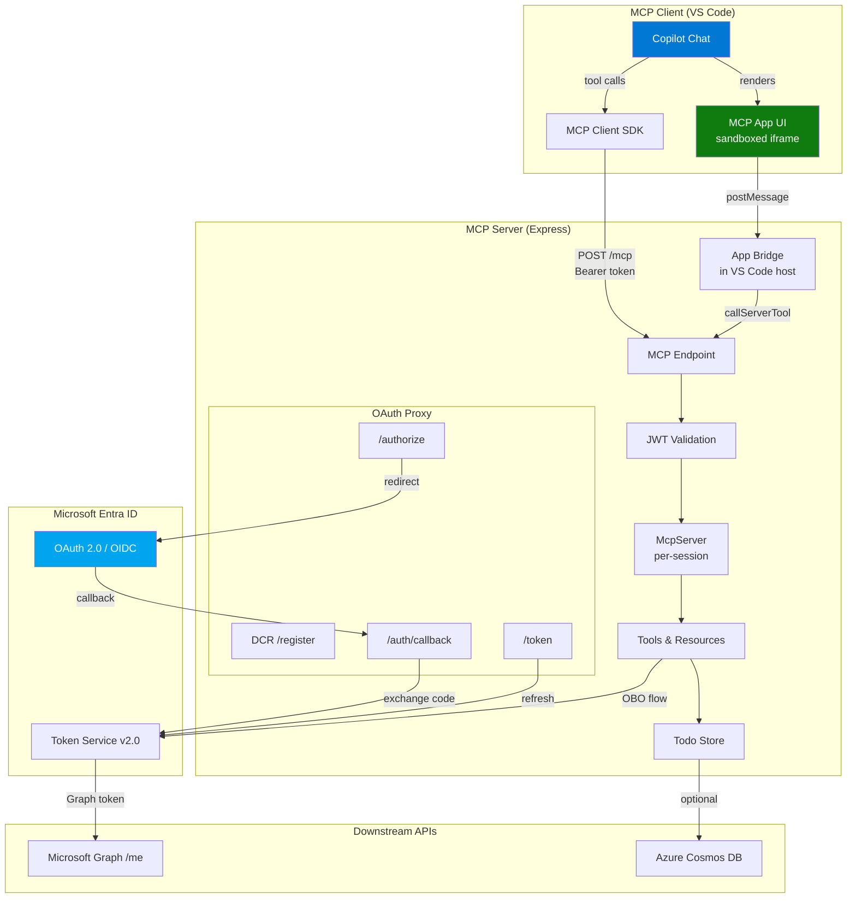
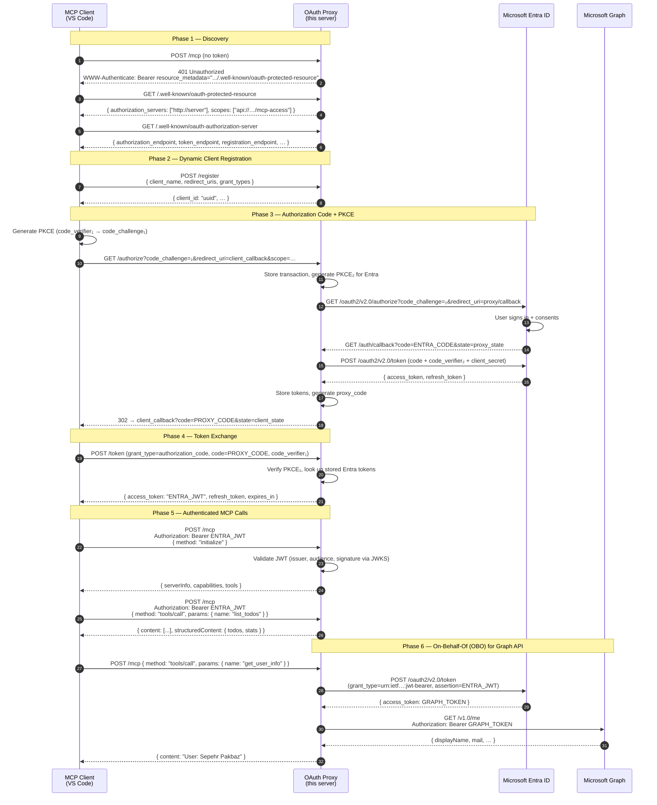
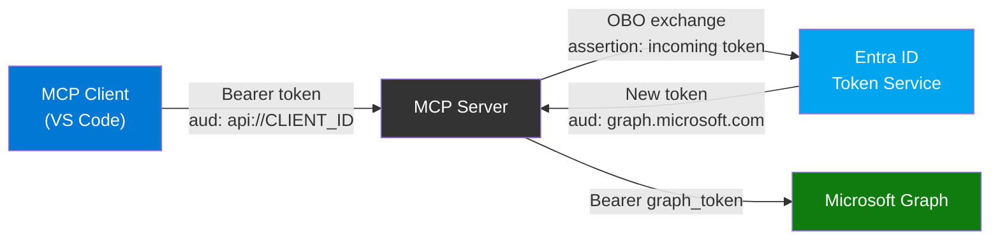
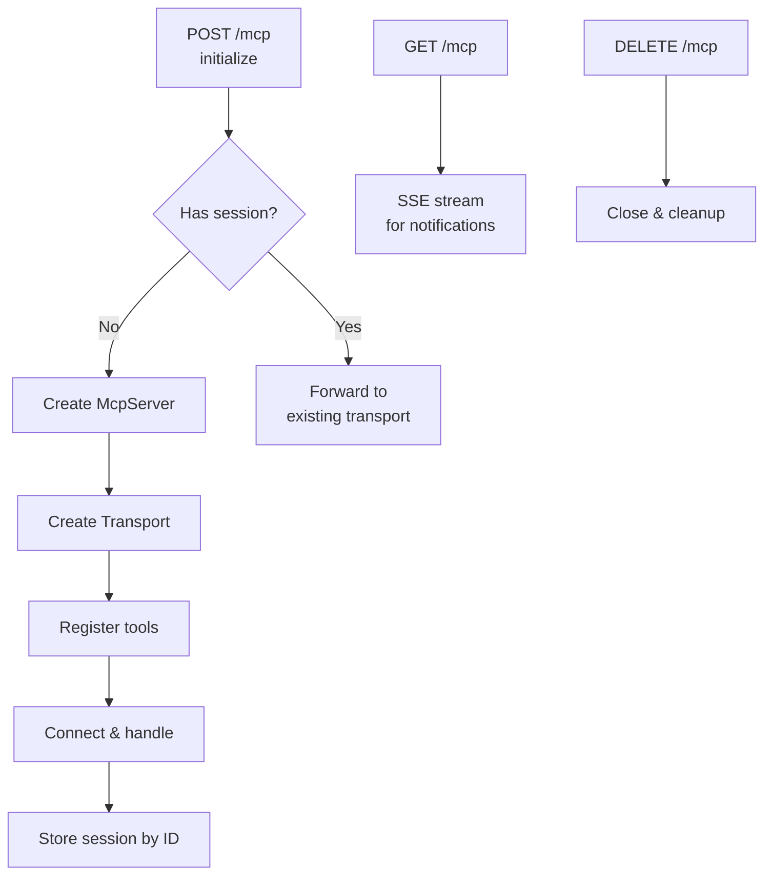
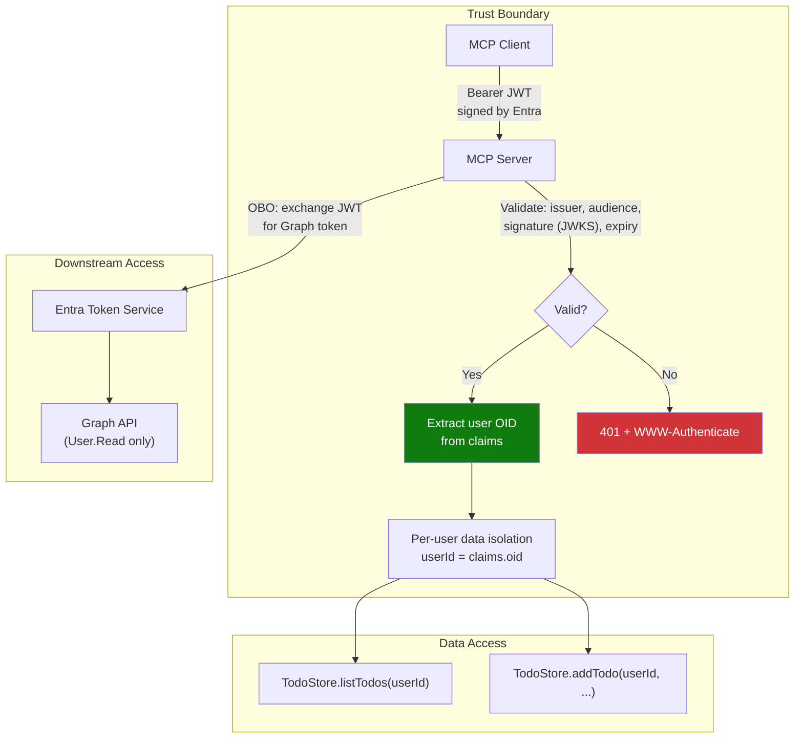

# MCP Todo App — Authenticated with Microsoft Entra ID

A full-featured **Model Context Protocol (MCP)** server with interactive UI,
**Microsoft Entra ID** authentication, and **On-Behalf-Of (OBO)** flow for
downstream API access. Built with TypeScript, Express, and the MCP SDK.

> **Key Concepts**: OAuth Proxy pattern for Entra ID, Dynamic Client Registration
> (DCR) bridging, PKCE, JWT validation, MCP Apps (ext-apps) interactive UI.

---

## Architecture Overview



---

## Authentication Flow

This app uses the **OAuth Proxy pattern** to integrate MCP's required
Dynamic Client Registration (DCR) with Microsoft Entra ID — which does not
natively support DCR. The MCP server itself acts as an OAuth authorization
server that proxies to Entra.

### Why an OAuth Proxy?

MCP clients (like VS Code) expect to register dynamically and perform OAuth
flows per [RFC 7591 (DCR)](https://datatracker.ietf.org/doc/html/rfc7591).
Entra ID only supports pre-registered app registrations. The proxy bridges
this gap:

| MCP Client expects | Entra ID provides | Proxy bridges |
|---|---|---|
| Dynamic Client Registration | Pre-registered apps only | `POST /register` → generates proxy `client_id` |
| Standard OAuth endpoints | Entra's v2.0 endpoints | Maps all endpoints through the proxy |
| PKCE with client | PKCE with server | Dual PKCE — one for client↔proxy, one for proxy↔Entra |

### Sequence Diagram — Full OAuth Flow



### Token Flow Summary



---

## Project Structure

```
├── src/
│   ├── server.ts              # Express app, MCP endpoint, session management
│   ├── tools.ts               # MCP tool & resource registration (ext-apps)
│   ├── auth/
│   │   ├── oauth-proxy.ts     # OAuth proxy (DCR, authorize, callback, token)
│   │   ├── validate-jwt.ts    # JWT validation middleware (Entra ID)
│   │   └── obo-helper.ts      # On-Behalf-Of flow (MSAL Node)
│   ├── store/
│   │   └── cosmos-store.ts    # Todo storage (Cosmos DB or in-memory)
│   └── ui/
│       ├── todo-app.ts        # Interactive HTML UI template
│       └── ext-apps-bundle.js # Inlined ext-apps SDK (bundled)
├── infra/                     # Azure Bicep IaC (Container Apps, Cosmos DB)
├── .vscode/mcp.json           # MCP server config for VS Code
├── azure.yaml                 # Azure Developer CLI config
├── Dockerfile                 # Container image
└── .env                       # Local environment variables (not committed)
```

---

## Key Components

### 1. OAuth Proxy (`src/auth/oauth-proxy.ts`)

Bridges MCP's DCR requirement with Entra ID's pre-registered app model.

| Endpoint | Purpose |
|---|---|
| `GET /.well-known/oauth-authorization-server` | RFC 8414 metadata — tells clients where to register, authorize, and get tokens |
| `POST /register` | Dynamic Client Registration — issues a proxy `client_id` to MCP clients |
| `GET /authorize` | Stores the client's PKCE, generates a new PKCE for Entra, redirects to Entra login |
| `GET /auth/callback` | Receives Entra's auth code, exchanges it for tokens, issues a proxy code to the client |
| `POST /token` | Validates the client's PKCE, returns the Entra tokens (or refreshes them) |
| `POST /revoke` | Token revocation (graceful no-op) |

### 2. JWT Validation (`src/auth/validate-jwt.ts`)

Express middleware that validates Entra ID v2.0 Bearer tokens on every MCP request:

- Fetches signing keys from Entra's JWKS endpoint (cached)
- Verifies issuer (`https://login.microsoftonline.com/{tenant}/v2.0`), audience (`client_id`), and signature (RS256)
- Extracts user claims (`oid`, `name`, `preferred_username`) into `req.auth`
- Returns `401` with `WWW-Authenticate: Bearer resource_metadata="..."` on missing/invalid tokens — this triggers VS Code's automatic OAuth flow

### 3. On-Behalf-Of Helper (`src/auth/obo-helper.ts`)

Uses MSAL Node's `ConfidentialClientApplication` to exchange the incoming MCP access token for downstream API tokens:

```
Incoming token (aud: api://CLIENT_ID/mcp-access)
        ↓ OBO flow
Downstream token (aud: https://graph.microsoft.com)
        ↓
GET /v1.0/me → { displayName, mail, ... }
```

### 4. MCP Apps UI (`src/ui/todo-app.ts`)

Interactive HTML UI rendered inside VS Code's Copilot Chat panel:

- Uses the `@modelcontextprotocol/ext-apps` SDK (inlined to avoid CSP issues)
- Communicates with the server via `app.callServerTool()` (postMessage bridge)
- Supports light/dark theme, inline editing, filtering, and real-time updates

### 5. Session Management (`src/server.ts`)

Each MCP client connection gets its own `McpServer` + `StreamableHTTPServerTransport` pair:



---

## Entra ID App Registration

### Required Configuration

| Setting | Value |
|---|---|
| **App type** | Web application |
| **Redirect URI** | `http://localhost:8000/auth/callback` (dev) |
| **API scope** | `api://{CLIENT_ID}/mcp-access` |
| **API permissions** | Microsoft Graph → `User.Read` (delegated) |
| **Client secret** | Required for OBO flow |

### Register via Azure CLI

```bash
# Create the app registration
az ad app create \
  --display-name "MCP Todo App" \
  --sign-in-audience AzureADMyOrg \
  --web-redirect-uris "http://localhost:8000/auth/callback" \
  --enable-access-token-issuance true \
  --enable-id-token-issuance true

# Add the API scope (mcp-access)
APP_ID=$(az ad app list --display-name "MCP Todo App" --query "[0].appId" -o tsv)
OBJECT_ID=$(az ad app list --display-name "MCP Todo App" --query "[0].id" -o tsv)

az rest --method PATCH \
  --uri "https://graph.microsoft.com/v1.0/applications/$OBJECT_ID" \
  --headers "Content-Type=application/json" \
  --body "{
    \"identifierUris\": [\"api://$APP_ID\"],
    \"api\": {
      \"oauth2PermissionScopes\": [{
        \"id\": \"$(uuidgen)\",
        \"adminConsentDisplayName\": \"Access MCP Todo App\",
        \"adminConsentDescription\": \"Allows the app to access MCP Todo App on behalf of the user\",
        \"userConsentDisplayName\": \"Access MCP Todo App\",
        \"userConsentDescription\": \"Allow the app to access MCP Todo App on your behalf\",
        \"value\": \"mcp-access\",
        \"type\": \"User\",
        \"isEnabled\": true
      }]
    }
  }"

# Create a service principal
az ad sp create --id $APP_ID

# Create a client secret
az ad app credential reset --id $APP_ID --display-name "MCP Server" --years 1

# Add Graph User.Read permission
GRAPH_APP_ID="00000003-0000-0000-c000-000000000000"
USER_READ_ID="e1fe6dd8-ba31-4d61-89e7-88639da4683d"
az ad app permission add --id $APP_ID --api $GRAPH_APP_ID --api-permissions "$USER_READ_ID=Scope"
```

---

## Environment Variables

Create a `.env` file (see `.env.sample`):

```env
# Microsoft Entra ID
ENTRA_CLIENT_ID=your-app-client-id
ENTRA_CLIENT_SECRET=your-client-secret
ENTRA_TENANT_ID=your-tenant-id

# Server
PORT=8000

# Optional — Azure Cosmos DB (falls back to in-memory store)
AZURE_COSMOSDB_ENDPOINT=https://your-account.documents.azure.com:443
AZURE_COSMOSDB_DATABASE=mcp-todo-app

# Optional — deployed server URL (for redirect URIs)
MCP_SERVER_BASE_URL=https://your-app.azurecontainerapps.io
```

---

## Getting Started

### Prerequisites

- Node.js 20+
- Azure CLI (`az`) — for Entra app registration
- An Azure AD / Entra ID tenant

### Run Locally

```bash
# Install dependencies
npm install

# Configure environment
cp .env.sample .env
# Edit .env with your Entra credentials

# Start development server
npm run dev

# Server starts at http://localhost:8000
```

### Configure VS Code

Add to `.vscode/mcp.json`:

```jsonc
{
  "servers": {
    "mcp-todo-app": {
      "type": "http",
      "url": "http://localhost:8000/mcp"
    }
  }
}
```

VS Code will automatically:
1. Send a request to `/mcp` → receive `401`
2. Discover the OAuth proxy via `/.well-known/oauth-protected-resource`
3. Register via DCR (`POST /register`)
4. Open the Entra sign-in page in the browser
5. Exchange the code for tokens
6. Retry `/mcp` with the Bearer token

### Deploy to Azure

```bash
# Using Azure Developer CLI
azd up
```

This provisions Azure Container Apps, Cosmos DB, Container Registry, and
Application Insights using the Bicep templates in `infra/`.

---

## MCP Tools

| Tool | Visibility | Description |
|---|---|---|
| `list_todos` | model, app | List todos with filtering (all/active/completed) |
| `add_todo` | model, app | Create a new todo item |
| `toggle_todo` | app | Toggle a todo's completion state |
| `edit_todo` | app | Update a todo's title or description |
| `delete_todo` | app | Delete a todo permanently |
| `get_user_info` | model, app | Get authenticated user's profile via Graph API (OBO) |

Tools with `visibility: ["app"]` are only callable from the interactive UI panel,
not by the LLM.

---

## Security Model



**Key security properties:**

- **No stored credentials** — The server uses Entra tokens; user passwords never touch the server
- **Per-user isolation** — Each user's todos are scoped to their Entra Object ID (`oid` claim)
- **Minimal permissions** — OBO tokens are scoped to `User.Read` only
- **PKCE everywhere** — Both client↔proxy and proxy↔Entra use PKCE (S256)
- **Token validation** — Every MCP request validates the JWT signature via Entra's JWKS endpoint
- **Sandboxed UI** — The HTML panel runs in a sandboxed iframe with no external network access

---

## References

- [MCP Specification](https://spec.modelcontextprotocol.io/)
- [MCP Apps (ext-apps)](https://github.com/modelcontextprotocol/ext-apps)
- [OAuth Proxy Pattern for MCP + Entra](https://techcommunity.microsoft.com/blog/azuredevcommunityblog/using-on-behalf-of-flow-for-entra-based-mcp-servers/4486760)
- [Entra ID On-Behalf-Of Flow](https://learn.microsoft.com/en-us/entra/identity-platform/v2-oauth2-on-behalf-of-flow)
- [RFC 9728 — Protected Resource Metadata](https://datatracker.ietf.org/doc/html/rfc9728)
- [RFC 7591 — Dynamic Client Registration](https://datatracker.ietf.org/doc/html/rfc7591)
- [RFC 8414 — Authorization Server Metadata](https://datatracker.ietf.org/doc/html/rfc8414)
